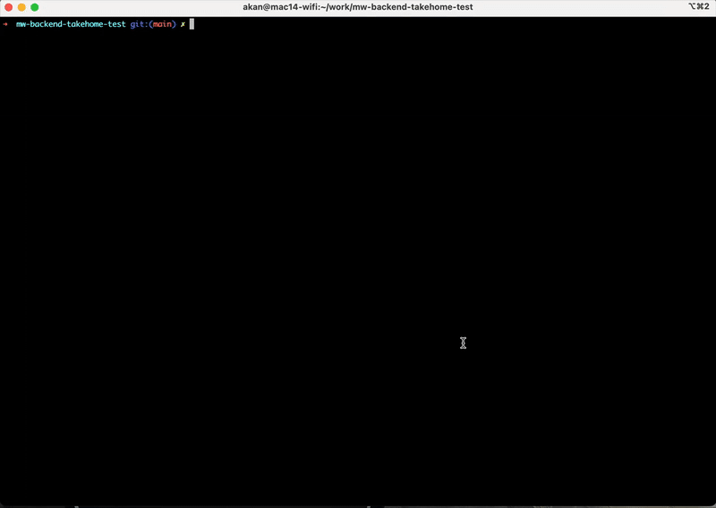
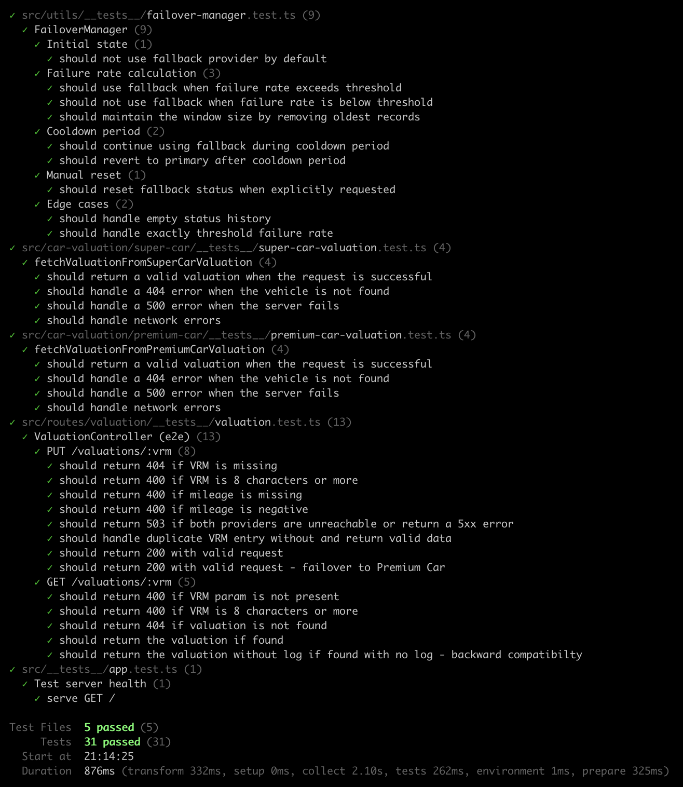
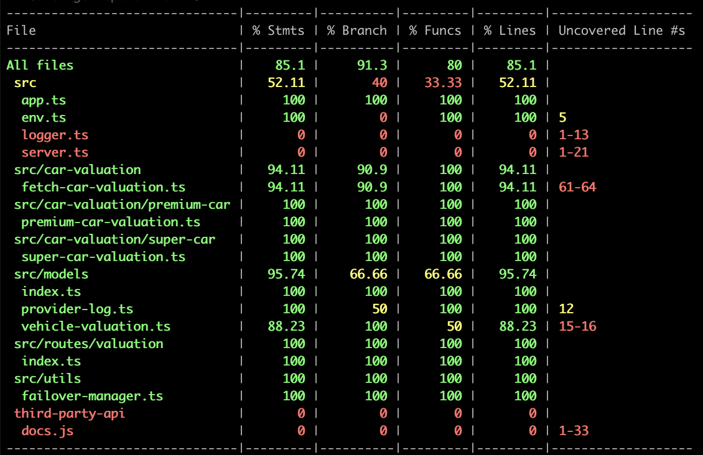

# Description

The Motorway backend take home code test. Please read the description and the brief carefully before starting the test.

**There's no time limit so please take as long as you wish to complete the test, and to add/refactor as much as you think is needed to solve the brief. However, we recommend around 60 - 120 minutes as a general guide, if you run out of time, then don't worry.**

**For anything that you did not get time to implement _or_ that you would like to change/add but you didn't feel was part of the brief, please feel free to make a note of it at the bottom of this README.md file**

## Installation

```bash
$ npm install
```

## Running the app

```bash
# development (local)
$ npm run dev

# production mode (deployed)
$ npm run start
```

## Test

```bash
# run all tests
$ npm run test

# test coverage
$ npm run test:coverage
```

## Current Solution

This API is a simple but important API for motorway that is responsible for retrieving valuations for cars from a 3rd party (SuperCar Valuations) by the VRM (Vehicle Registration Mark) and mileage.

- The API has two routes

  - A PUT (/valuations/{vrm}) request to create a valuation for a vehicle which accepts a small amount of input data and performs some simple validation logic.
  - A GET (/valuations/{vrm}) request to get an existing valuation. Returns 404 if no valuation for the vrm exists.

- The PUT operation handles calling a third-party API to perform the actual valuation, there is some rudimentary mapping logic between Motorway & 3rd party requests/responses.
- The PUT request is not truly idempotent so the 3rd party is called each time this operation is called and the code catches duplicate key exceptions when writing to the database.
- If the 3rd party is unreachable or returns a 5xx error, the service returns a 500 Internal Server Error.
- The outcome is stored in a database for future retrieval in the GET request.
- All the logic for the entire operation is within a single method in a single "service" class.
- A QA engineer has added some high-level tests.
- The tests for validation failures all pass.
- A simple happy path test is currently failing as the I/O calls for the database and 3rd party have not been isolated and the clients are trying to hit real resources with an invalid configuration.

## Task Brief

As this is such an important service to Motorway, a decision has been made to add a fallback 3rd party provider called Premium Car Valuations in case SuperCar Valuations is unavailable for a period of time. Before we add any more features, we need to fix the broken test.

Here are a full list of tasks that need to be completed:

**Tests**

- Modify the code/test so that the existing test suite passes and no I/O calls are made during the execution of the test suite.

- Add a test for the GET call.

- All new functionality should have test coverage in a new or updated existing test.

**Features**

- Introduce a basic failover mechanism to call the fallback 3rd party provider (Premium Car Valuations) in the event that the failure rate of the calls to SuperCar Valuations exceeds 50%. To keep the test simple, assume this service is running as a single instance. Feel free to discuss how you might solve it differently if the service was to execute in a multi-node cluster. Be mindful that this is a popular API, therefore the solution needs to be able to handle tracking the success rate of a large number of requests.

- As Premium Car Valuations is more expensive to use, there is a need to revert back to SuperCar Valuations after a configurable amount of time. At this point, the failure rate to indicate failover should be reset.

- If both providers are unreachable or return a 5xx error, then the service should now return a 503 Service Unavailable Error.

- To save costs by avoiding calling either 3rd party, improve the PUT operation so that the providers are not called if a valuation has already occurred. NOTE: This is to save costs, not for any consistency concerns between Motorway and the 3rd party. (Don't worry about concurrency, if two requests for the same route occur at the same time, either response can be saved).

- To help increase customer confidence regarding the valuation Motorway shows the user, there is a new requirement to show the name of the provider who provided the valuation to the user on the front end, e.g. "Valued by Trusted Company {X}", therefore the name of the provider that was used for the valuation needs to be persisted in the database and returned in the response.

- The service should be tolerant to older records where there is no detail of the provider (Backwards Compatible).

- Refactor the code as you see fit to ensure it is more readable, maintainable and extensible.

- To help with auditing service level agreements with the providers over an indefinite time period, there is a need to store the following details of the request:

  - Request date and time
  - Request duration
  - Request url
  - Response code
  - Error code/message if applicable and the
  - Name of the provider

  The details must be stored in a ProviderLogs table, which is correlated to a VRM, there could potentially be more than one log per VRM.

## 3rd Party APIs

For the purposes of this code test, simple mocks have been created use a service called [Mocky](https://designer.mocky.io/) with simple canned responses. Assume, that these would be real RESTful/SOAP services.

## 3rd Party OpenAPI Specs

Details of the existing 3rd party (SuperCar Valuations) and the new provider (Premium Car Valuations) can be found below.

To view the OpenAPI specifications for the 3rd Party APIs at the links below, first run the `npm run third-party-api:serve-docs` command.

### SuperCar Valuations

This is the current and preferred provider used for valuations, it is a fairly modern and cost-effective API.

The OpenAPI Specification can be found [here](http://localhost:3001/docs).

The URI for this test stub in Mocky is https://run.mocky.io/v3/04565792-82c3-4d44-8e82-052bf5d03a24.

### Premium Car Valuations

This is the proposed fallback provider to be used for valuations, it is an old service and costs significantly more for each call.

The OpenAPI Specification can be found [here](http://localhost:3002/docs).

The URI for this test stub in Mocky is https://run.mocky.io/v3/6460ac02-fc5b-47ef-85f5-bf4affc7c0de.

# Candidate Notes

Here is a place for you to put any notes regarding the changes you made and the reasoning and what further changes you wish to suggest.

## Architecture Summary

I've completely refactored the car valuation API to be more maintainable, extensible, and robust. Here's a summary of the key components and the improvements made:

### Key Components

1. **Providers** - I've implemented two providers

   - SuperCarProvider - `fetchValuationFromSuperCarValuation` Primary car valuation provider
   - PremiumCarProvider - `fetchValuationFromPremiumCarValuation` Fallback provider

2. **FailoverManager** - Handles the failover logic with potentially configurable parameters:

   - Tracks request success/failure rates
   - Switches to fallback provider when primary provider failure rate exceeds threshold
   - Implements cooldown period to revert back to primary provider

3. **Services**:

   - ValuationService - `fetchCarValuation` Handles business logic for creating and retrieving valuations

4. **Repositories**:

   - ValuationRepository - Handles database operations for valuations
   - ProviderLogRepository - Handles logging of provider requests

5. **Controllers & Routes**:
   - ValuationController - Handles HTTP requests and responses
   - valuationRoutes - Defines API routes and validation

### Improvements

1. **Cost Optimization**:

   - Check database for valuations to avoid calling providers for existing valuations
   - Request logs are stored for auditing and monitoring purposes

2. **Fault Tolerance**:

   - Implemented failover mechanism with potentially configurable threshold
   - Returns 503 Service Unavailable when both providers fail
   - Added cooldown period to revert to primary provider

3. **Provider Tracking**:

   - Added provider name to valuation records
   - Implemented backwards compatibility for existing records without provider name
   - Added comprehensive logging of all provider requests

4. **Architecture**:

   - Separated concerns into appropriate layers

5. **Testing**:
   - Added comprehensive functional tests for the API
   - Used nock for mocking HTTP requests to third-party providers

### Multi-Node Cluster Considerations

For a multi-node cluster deployment, the current implementation has a limitation since the FailoverManager tracks failure rates locally to each instance. Here are some approaches to handle this:

1. **Distributed Cache** - Use Redis or a similar distributed cache to track failure rates across all instances:

   - Each instance would update the shared counter when experiencing failures
   - The failover decision would be based on aggregate data

2. **Event-Driven Architecture** - Implement a message bus (Kafka, RabbitMQ):

   - Instances broadcast provider failures to all other instances
   - Each instance maintains a synchronized view of the overall system health

3. **Centralized Health Check** - Implement a dedicated health monitoring service:
   - All instances report their provider interactions
   - The health monitor decides when to trigger failover
   - Instances query the health monitor to determine which provider to use

This implementation addresses all the requirements while providing a clean, maintainable architecture that can be easily extended in the future.

## Demo

To simulate failover, you need to do the following:

1. change the primary provider `SUPER_CAR_BASE_URL` URL in the `.env.demo` file to a non-existent URL
2. Run the application:

```shell
npm run demo
```

3. Run this script:

```shell
./scripts/failover-demo.sh
```

### Demo output



## Test report



### Code coverage


